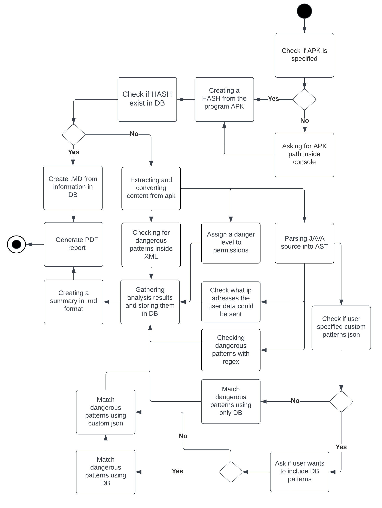
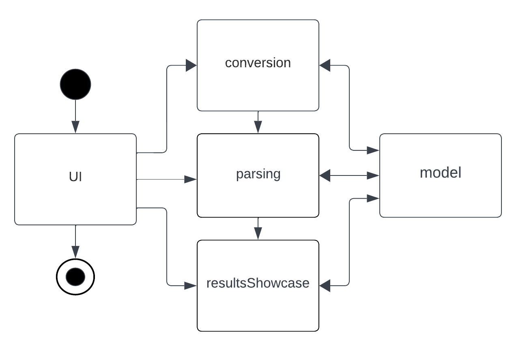

# Project Architecture Overview

## Project flowchart

## Interaction Among Key Program Components

### UI component

This component is responsible for managin user interaction with the console. It handles users input, validates it, and triggers the appropriate actions based on the input. It also prints current state of the program to the console

Main responsibilities of this component:

- **Managing User Input**: It provides methods for validating the input `APK` file and extracting its contents. It also handles command-line arguments to set the `APK` file path, the multithreading option, the verbose option, and the output paths for the `PDF` and `APK` extraction.

- **Managing APK Analysis Process**: After validating the user input, it starts the conversion and analysis process by calling the `ConversionProcess`, `ParsingProcess`, and `ResultsShowcase` components.

- **Error Handling**: If an error occurs during the process, it displays the error message and prompts the user with a choice to either keep the converted files or delete the created folder.

### Conversion Component

This component is responsible for the conversion process of `APK` files. It handles the following tasks:

1. **Unzipping APKs**: `APK` files are unzipped into a temporary directory.
1. **XML Conversion**: The component then transforms XML files within the unzipped APK.
1. **DEX to JAR**: It converts DEX files into JAR format.
1. **JAR Filtering**: Unnecessary JAR files are systematically filtered out.
1. **Class to Source Code Conversion**: Finally, class files in JARs are converted into source code.

Within this component, various classes are dedicated to specific tasks:

- **ConversionProcess**: Orchestrates the entire `APK` conversion process.
- **ClassConverter**: Transforms .jar files into Java source code using the `CFR` decompiler.
- **Dex2JarExecutor**: Converts `DEX` files into `JAR` files.
- **JarFilter**: Removes unnecessary components from `JAR` files.
- **UnzipFile**: Handles the unzipping of `APK` files.
- **XMLConverter**: Transforms binary `AndroidManifest.xml` into readable `XML` format.

### Model Component

This component is responsible for defining the data models used throughout the application. These models represent the structure of the data that the application works with.

### Parsing Component

Parsing component in itself is devided into `javaparsing` and `xmlparsing` subcomponents

- **javaParsing**: this subcomponent analyzes Java source code, detecting specified patterns and identifying IP/Domain addresses. It leverages the `JavaParser` library to utilize `Abstract Syntax Tree (AST)` for in-depth code analysis.

- **xmlparsing**: Analyses `XML` files , particularly the `AndroidManifest.xml`, this subcomponent plays a crucial role in parsing `XML` data.

### ResultsShowcse component

The `resultshowcase` component is responsible for generating and managing the results of the parsing processes. It compiles the extracted data into a `markdown` file, then converts it into a `PDF` file. Here's a brief overview of each class:

- `MDGenerator`: A utility class designed to generate a markdown file encapsulating the analysis results.

- `PDFConverter`: This class transforms a markdown file into a `PDF`, initially converting markdown to `HTML`, followed by utilizing the `openhtmltopdf` library for the final `PDF` conversion.

- `Results`: Orchestrates the results management, creating a detailed markdown document covering permissions, file details, and detected patterns. It also oversees the conversion of this markdown into a `PDF`, followed by the deletion of the temporary markdown file.
